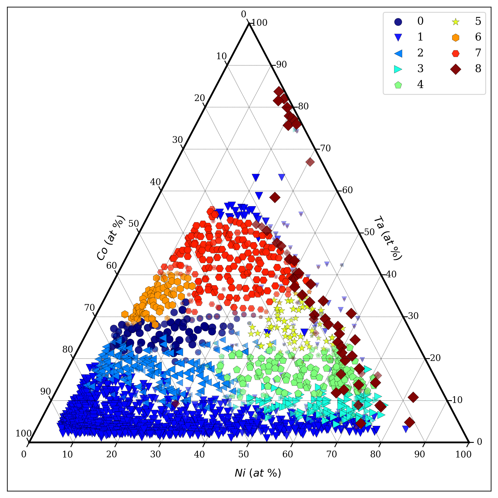
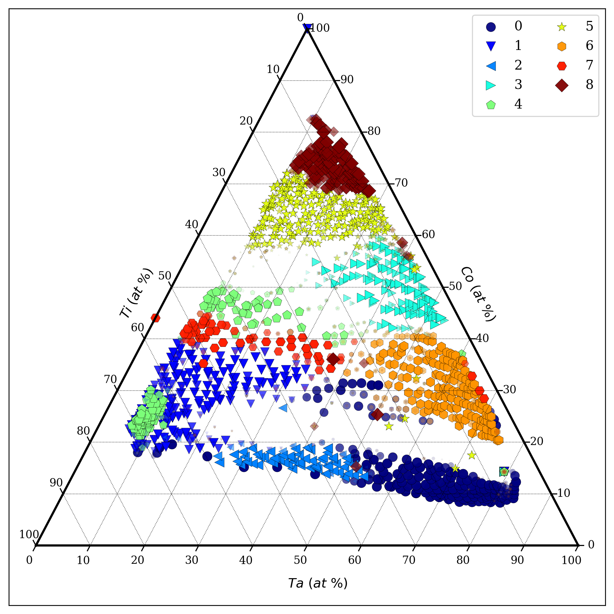
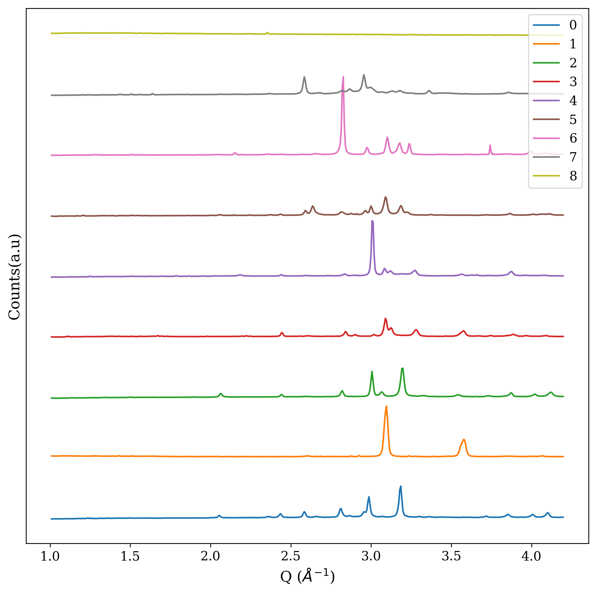
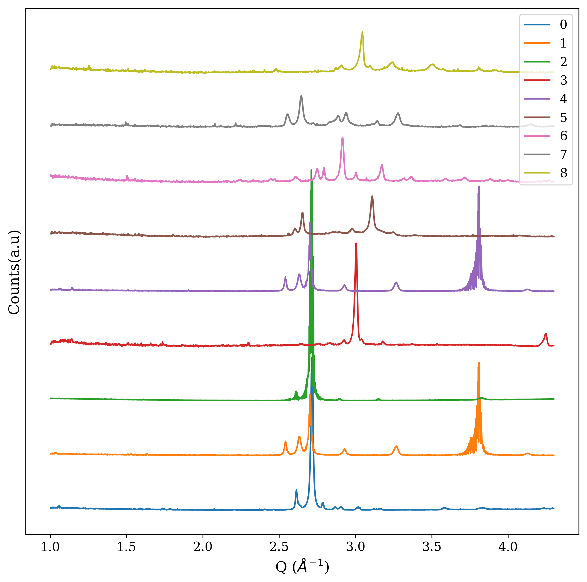

# Enhancing Phase Mapping for High-throughput X-ray Diffraction Experiments using Fuzzy Clustering

X-ray diffraction (XRD) is a widely used experiment in materials science to understand the composition-structure-property relationships of materials for designing and discovering new materials. Traditionally, domain scientists analyze the XRD samples manually by examining their peak characteristics and comparison against the reference database. However, with the advent of high-throughput experiments producing large volumes of samples, XRD analysis has become an arduous task for domain scientists. Recently, they have started leveraging clustering algorithms to reduce the sample space that requires manual labeling and validation. Nevertheless, the current practice of hard clustering techniques does not work well. A key aspect of XRD analysis is that the composition-phase diagram is composed of not only pure phases but also their mixed phases. Hard clustering approach treats the mixed phases as separate independent clusters from their constituent pure phases, hence, resulting in incorrect phase diagrams which complicate the next steps. This repository contains the code to demonstrate a novel clustering approach of XRD patterns by leveraging a fuzzy clustering technique that can significantly enhance the potential phase mapping and reduce the manual efforts involved in XRD analysis. The proposed approach first generates an initial composition-phase diagram and initial pure phase representations by applying the fuzzy c-means clustering algorithm, followed by hierarchical clustering to accomplish effortless manual merging of similar initial pure phases to generate the final composition-phase diagram. The proposed method is evaluated on the XRD samples from two high-throughput composition-spread experiments of Co-Ni-Ta and Co-Ti-Ta ternary alloy systems. Our results demonstrate significant improvement compared to hard clustering and almost completely eliminate manual efforts.

Final composition-phase diagram using proposed approach are shown below for both systems. There are 9 final pure phases for both ternary systems.

### Co-Ni-Ta composition-phase diagram

  

### Co-Ti-Ta composition-phase diagram

  

Final pure phase representations after merging similar initial pure phases are demonsrated below for both Co-Ni-Ta and Co-Ti-Ta. The final pure phase representations are significantly different from each other which illustrates the efficiency of the proposed approach:

### Co-Ni-Ta phase representations

  

### Co-Ti-Ta phase representations

  

## Developer Team

The code was developed by Dipendra Jha from the <a href="http://cucis.ece.northwestern.edu/">CUCIS</a> group at the Electrical and Computer Engineering Department, and K. V. L. V. Narayanachari from the <a href="http://bedzyk.mccormick.northwestern.edu">Bedzyk Research group</a> at the Department of Materials Science and Engineering at Northwestern University.

## Publications

Please cite the following publication if you use this repository :

1. Dipendra Jha, K. V. L. V. Narayanachari, Ruifeng Zhang, Denis T. Keane, Wei Keng Liao, Alok Choudhary, Yip Wah Chung, Michael J. Bedzyk, and Ankit Agrawal. "Enhancing phase mapping for high-throughput X-ray diffraction experiments using fuzzy clustering." In 10th International Conference on Pattern Recognition Applications and Methods, ICPRAM 2021, pp. 507-514. SciTePress, 2021. [<a href="https://www.scholars.northwestern.edu/en/publications/enhancing-phase-mapping-for-high-throughput-x-ray-diffraction-exp">PDF</a>].

## Questions/Comments

email: dipendra.jha@eecs.northwestern.edu, or ankitag@eecs.northwestern.edu 
Copyright (C) 2021, Northwestern University. 
See COPYRIGHT notice in top-level directory.

## Funding Support

This work was performed under the following financial assistance award 70NANB14H012 and 70NANB19H005 from U.S. Department of Commerce, National Institute of Standards and Technology as part of the Center for Hierarchical Materials Design (CHiMaD), DND-CAT located at Sector 5 of the Advanced Photon Source (APS) at Argonne National Lab  supported by DOE under Contract No. DE-AC02-06CH11357,  the MRSEC program of the National Science Foundation (DMR-1720139), and the Soft and Hybrid Nanotechnology Experimental (SHyNE) Resource (NSF NNCI-1542205). Partial support is also acknowledged from DOE awards DE-SC0014330, DE-SC0019358.
